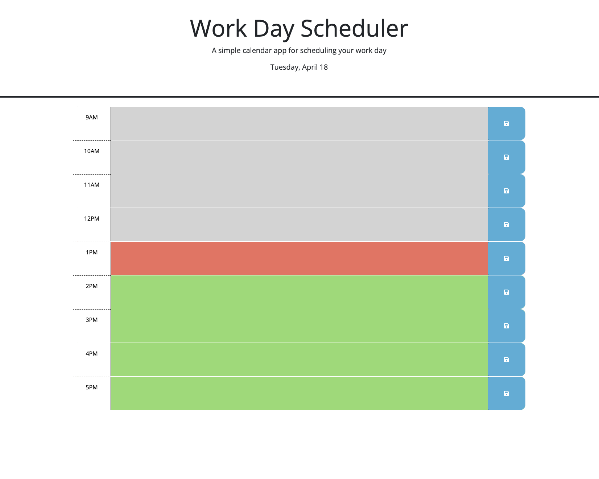
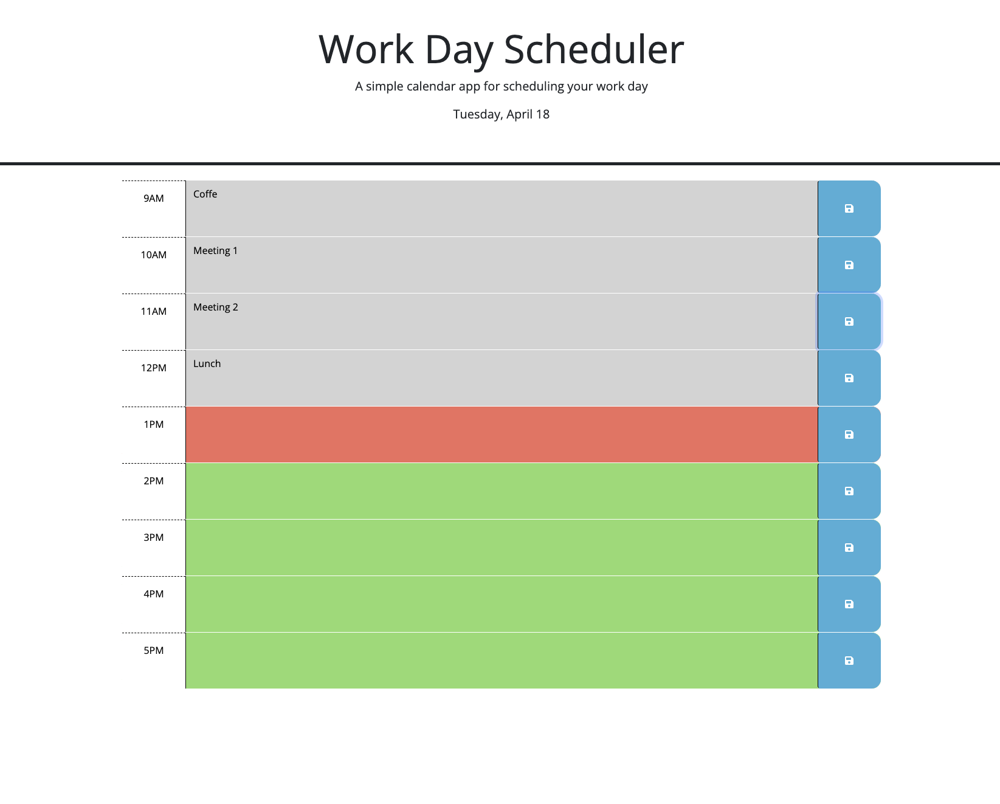

# Daily Planner
## Description

This application was built so that user can save events for each hour of the day (9am-5pm). It will indicate the past hour= grey, current hour= red, future hour= green.
Please visit the application here: [Work Day Scheduler](https://retnodamayanti.github.io/daily_planner/)

## Installation

N/A

## Usage
- The screenshot below display the application with no event saved

- The screenshot below shows the current time is marked with red color

- The screenshot below shows the saved events

 
## Credit
- [Bootcamp GitLab Challenge 05 Third-Party APIs: Work Day Scheduler](https://git.bootcampcontent.com/University-of-Adelaide/UADEL-VIRT-FSF-PT-03-2023-U-LOLC/-/tree/main/05-Third-Party-APIs/02-Challenge) 
- Assistance from TA and Tutor
## License

Please refer to the LICENSE in the repo.